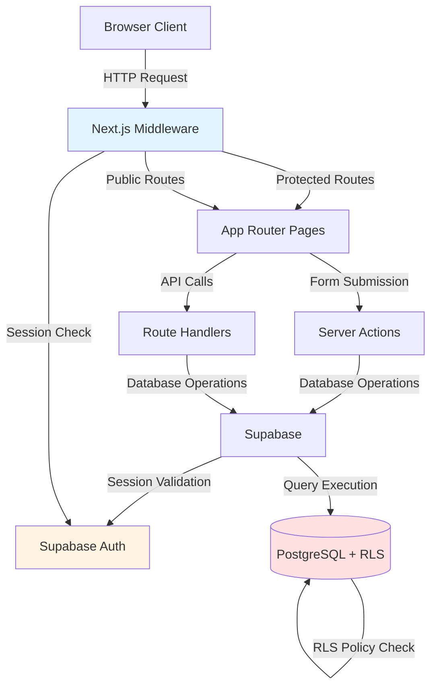
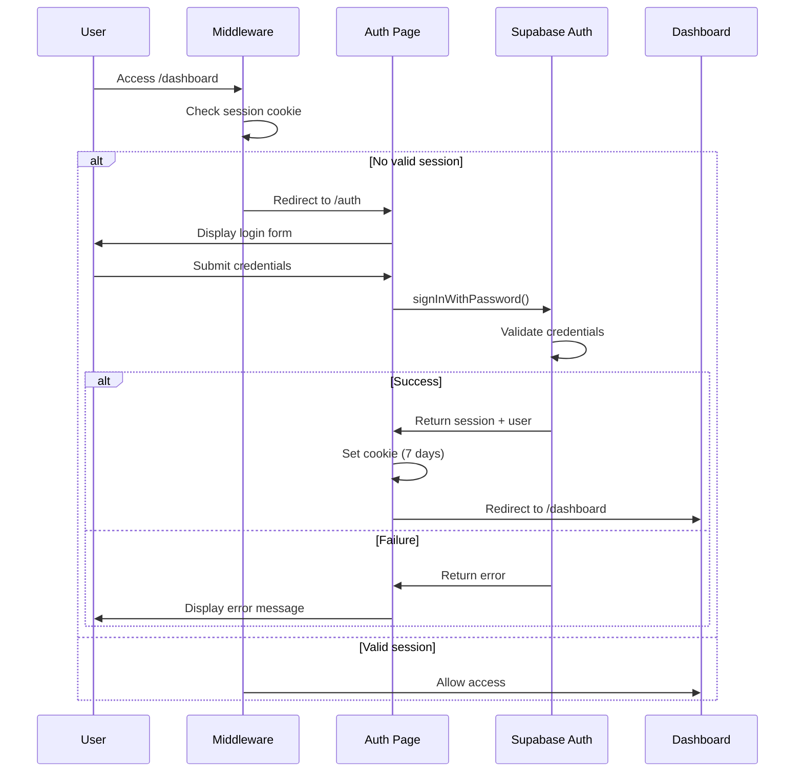

# Design Document

## Overview

KasirKu is a multi-tenant SaaS Point of Sale (POS) system designed for Indonesian small businesses (UMKM). The application enables business owners to manage orders with automatic queue numbers, maintain menu items with pricing, and generate financial reports across daily, weekly, and monthly periods.

### Architecture Philosophy

The system follows a server-first architecture leveraging Next.js 14 App Router capabilities to maximize security and performance. Authentication and authorization are handled at multiple layers: middleware for route protection, Row Level Security (RLS) for database-level isolation, and server components for secure data fetching. This defense-in-depth approach ensures tenant data isolation even if application-layer checks fail.

### Technology Stack

- **Frontend Framework**: Next.js 14 (App Router)
- **Language**: TypeScript
- **Styling**: Tailwind CSS
- **UI Components**: shadcn/ui
- **Authentication & Database**: Supabase
  - PostgreSQL database with Row Level Security
  - Built-in authentication service
  - Real-time subscriptions (future enhancement)

### Key Design Principles

1. **Multi-Tenancy First**: Every data access pattern considers tenant isolation from the database layer up
2. **Server-Side Security**: Sensitive operations execute exclusively in Server Components, Route Handlers, and Server Actions
3. **Progressive Enhancement**: Core functionality works with JavaScript disabled where feasible
4. **Mobile-First Responsive**: UI adapts from 320px mobile screens to 1920px desktop displays

## Architecture

### System Architecture



### Authentication Flow



### Multi-Tenant Data Isolation

The system implements multi-tenant architecture using three isolation layers:

1. **Application Layer**: Server Actions and Route Handlers retrieve the authenticated user's tenant_id and filter queries
2. **Database Layer**: PostgreSQL Row Level Security (RLS) policies enforce tenant_id filtering on every query
3. **Schema Layer**: Foreign key constraints ensure referential integrity across tenant boundaries

This layered approach follows the [defense-in-depth principle](https://metadesignsolutions.com/blog/supabase-rls-patterns-production-guide-multi-tenant-saas), where RLS acts as the ultimate enforcement mechanism even if application code contains bugs.

## Components and Interfaces

### Page Components

#### 1. Landing Page (`app/page.tsx`)

**Purpose**: Public marketing page describing KasirKu features

**Component Type**: Server Component (static or ISR)

**Key Features**:
- Describes minimum 3 KasirKu features
- "Get Started" link to `/auth`
- Accessible to both authenticated and unauthenticated users
- Responsive hero section with feature grid

**Logo Specifications**:
- **Desktop (≥768px)**: Width 160px, Height 42px (h-10 w-auto)
- **Mobile (<768px)**: Width 140px, Height 37px (h-9 w-auto)
- Logo should maintain aspect ratio and use Next.js Image component
- Logo should be prominent and easily visible in the navigation header
- Logo should have priority loading to prevent layout shift

**Technical Notes**:
- Can be statically generated for performance
- No authentication required
- Mobile-first responsive layout using Tailwind
- Logo sizing optimized for brand visibility while maintaining clean navbar layout

---

#### 2. Authentication Page (`app/auth/page.tsx`)

**Purpose**: Unified login and registration interface

**Component Type**: Client Component (for form interactivity)

**State Management**:
```typescript
interface AuthState {
  mode: 'login' | 'register';
  email: string;
  password: string;
  error: string | null;
  isLoading: boolean;
}
```

**Form Validation**:
- Email: RFC 5322 compliant format (using native HTML5 validation or library like `validator.js`)
- Password: 8-128 characters
- Both fields required (non-empty)

**Server Action Integration**:
- Calls `signInAction()` or `signUpAction()` Server Actions
- Server Actions use `@supabase/ssr` to create server-side client
- On success: Set session cookie, redirect to `/dashboard`
- On failure: Return error message to display

**Middleware Behavior**:
- If user has valid session accessing `/auth`, redirect to `/dashboard`

---

#### 3. Dashboard Page (`app/dashboard/page.tsx`)

**Purpose**: Overview and navigation hub

**Component Type**: Server Component

**Layout Structure**:
- Protected layout wrapper (`app/dashboard/layout.tsx`)
- Navigation sidebar/header with links to:
  - `/dashboard/order` (Order Management)
  - `/dashboard/menu` (Menu Management)
  - `/dashboard/laporan` (Financial Reports)
- Main content area for future dashboard widgets

**Session Handling**:
- Middleware validates session before rendering
- If session expired, redirect to `/auth`
- Server Component fetches user/tenant data for display

---

#### 4. Order Management Page (`app/dashboard/order/page.tsx`)

**Purpose**: Create new orders with automatic queue numbers

**Component Type**: Hybrid (Server Component wrapper + Client Component form)

**Data Flow**:
1. Server Component fetches menu items for current tenant
2. Client Component renders order form with menu item selection
3. User selects items, quantities
4. Form submits to `createOrderAction()` Server Action
5. Server Action:
   - Validates session and extracts tenant_id
   - Generates queue number (sequential, daily reset at 00:00 UTC+7)
   - Calculates total_amount
   - Inserts order into database
   - Returns success with queue number

**Queue Number Generation Logic**:
```typescript
// Pseudo-code
async function getNextQueueNumber(tenantId: string): Promise<number> {
  const startOfDay = getStartOfDay('UTC+7');
  const lastOrder = await db
    .from('orders')
    .select('queue_number')
    .eq('tenant_id', tenantId)
    .gte('created_at', startOfDay)
    .order('queue_number', { ascending: false })
    .limit(1)
    .single();
  
  return lastOrder ? lastOrder.queue_number + 1 : 1;
}
```

**UI Components**:
- Menu item selector (dropdown or search)
- Quantity input (number field, min: 1)
- Line item list with subtotals
- Total amount display
- Submit button
- Queue number display after successful submission

---

#### 5. Menu Management Page (`app/dashboard/menu/page.tsx`)

**Purpose**: CRUD operations for menu items

**Component Type**: Hybrid (Server Component + Client Component form)

**Operations**:

**Create**:
- Form: name (1-200 chars), price (0.00-999999999.99)
- Server Action: `createMenuItemAction()`
- Validates tenant_id from session
- Inserts with tenant_id

**Read**:
- Server Component queries menu items filtered by tenant_id
- Displays in table or card grid

**Update**:
- Inline edit or modal form
- Server Action: `updateMenuItemAction(id, data)`
- Validates item belongs to tenant
- RLS policy enforces tenant_id match

**Delete**:
- Confirmation dialog
- Server Action: `deleteMenuItemAction(id)`
- Validates item belongs to tenant
- RLS policy prevents cross-tenant deletion

**Error Handling**:
- Name > 200 chars: "Name must be 200 characters or less"
- Price out of range: "Price must be between Rp 0 and Rp 999,999,999.99"
- Permission denied: "You don't have permission to modify this item"
- Database error: "Failed to save changes. Please try again."

---

#### 6. Financial Reports Page (`app/dashboard/laporan/page.tsx`)

**Purpose**: Display revenue reports for daily, weekly, monthly periods

**Component Type**: Server Component with URL search params

**URL Structure**:
- `/dashboard/laporan?view=daily&date=2025-01-15`
- `/dashboard/laporan?view=weekly&start=2025-01-13`
- `/dashboard/laporan?view=monthly&month=2025-01`

**Data Aggregation**:
```typescript
async function calculateRevenue(
  tenantId: string,
  startDate: Date,
  endDate: Date
): Promise<number> {
  const { data } = await supabase
    .from('orders')
    .select('total_amount')
    .eq('tenant_id', tenantId)
    .gte('created_at', startDate.toISOString())
    .lte('created_at', endDate.toISOString());
  
  return data?.reduce((sum, order) => sum + order.total_amount, 0) || 0;
}
```

**Time Zone Handling**:
- All date boundaries calculated in UTC+7 (WIB - Western Indonesia Time)
- Daily: 00:00:00 to 23:59:59 UTC+7
- Weekly: Start date 00:00:00 to start date + 6 days 23:59:59 UTC+7
- Monthly: First day 00:00:00 to last day 23:59:59 UTC+7

**Currency Formatting**:
```typescript
function formatIDR(amount: number): string {
  return `Rp ${amount.toLocaleString('id-ID', {
    minimumFractionDigits: 0,
    maximumFractionDigits: 0
  })}`;
}
// Example: 1500000 → "Rp 1.500.000"
```

**UI Components**:
- View selector (tabs or dropdown: Daily/Weekly/Monthly)
- Date picker appropriate to view type
- Revenue display with large formatted amount
- Optional: Chart visualization (bar/line chart)

### Server Actions

Server Actions provide type-safe, server-side mutations using Next.js Server Actions feature (stable in Next.js 14).

#### Authentication Actions (`app/auth/actions.ts`)

```typescript
'use server'

import { createServerClient } from '@supabase/ssr';
import { cookies } from 'next/headers';
import { redirect } from 'next/navigation';

export async function signUpAction(formData: FormData) {
  const email = formData.get('email') as string;
  const password = formData.get('password') as string;
  
  // Validation
  if (!email || !password) {
    return { error: 'All fields are required' };
  }
  
  if (password.length < 8 || password.length > 128) {
    return { error: 'Password must be 8-128 characters' };
  }
  
  const supabase = createServerClient(/* ... */);
  
  const { data, error } = await supabase.auth.signUp({
    email,
    password
  });
  
  if (error) {
    if (error.message.includes('already registered')) {
      return { error: 'Email is already registered' };
    }
    return { error: 'Registration failed' };
  }
  
  // Create tenant for new user
  await createTenantForUser(data.user.id);
  
  redirect('/dashboard');
}

export async function signInAction(formData: FormData) {
  // Similar structure
}
```

#### Order Actions (`app/dashboard/order/actions.ts`)

```typescript
'use server'

export async function createOrderAction(items: OrderItem[]) {
  const supabase = createServerClient(/* ... */);
  
  // Get authenticated user's tenant_id
  const { data: { user } } = await supabase.auth.getUser();
  const tenantId = await getTenantId(user.id);
  
  // Generate queue number
  const queueNumber = await getNextQueueNumber(tenantId);
  
  // Calculate total
  const totalAmount = items.reduce(
    (sum, item) => sum + item.price * item.quantity,
    0
  );
  
  // Insert order
  const { data, error } = await supabase
    .from('orders')
    .insert({
      tenant_id: tenantId,
      queue_number: queueNumber,
      total_amount: totalAmount,
      status: 'completed'
    })
    .select()
    .single();
  
  if (error) {
    return { error: 'Failed to create order' };
  }
  
  return { success: true, queueNumber: data.queue_number };
}
```

#### Menu Actions (`app/dashboard/menu/actions.ts`)

```typescript
'use server'

export async function createMenuItemAction(
  name: string,
  price: number
) {
  // Validation
  if (name.length < 1 || name.length > 200) {
    return { error: 'Name must be 1-200 characters' };
  }
  
  if (price < 0 || price > 999999999.99) {
    return { error: 'Invalid price range' };
  }
  
  const supabase = createServerClient(/* ... */);
  const { data: { user } } = await supabase.auth.getUser();
  const tenantId = await getTenantId(user.id);
  
  const { error } = await supabase
    .from('menu_items')
    .insert({
      tenant_id: tenantId,
      name,
      price
    });
  
  if (error) {
    return { error: 'Failed to create menu item' };
  }
  
  revalidatePath('/dashboard/menu');
  return { success: true };
}

export async function updateMenuItemAction(
  id: string,
  name: string,
  price: number
) {
  // Similar validation
  // RLS ensures only tenant's items can be updated
}

export async function deleteMenuItemAction(id: string) {
  // RLS ensures only tenant's items can be deleted
}
```

### Middleware (`middleware.ts`)

[Middleware](https://nextjs.org/docs/14/app/building-your-application/authentication) runs before every request to protect routes and validate sessions.

```typescript
import { createServerClient } from '@supabase/ssr';
import { NextResponse } from 'next/server';
import type { NextRequest } from 'next/server';

export async function middleware(request: NextRequest) {
  const { pathname } = request.nextUrl;
  
  // Create Supabase client for middleware
  const response = NextResponse.next();
  const supabase = createServerClient(
    process.env.NEXT_PUBLIC_SUPABASE_URL!,
    process.env.NEXT_PUBLIC_SUPABASE_ANON_KEY!,
    {
      cookies: {
        get: (name) => request.cookies.get(name)?.value,
        set: (name, value, options) => {
          response.cookies.set(name, value, options);
        },
        remove: (name, options) => {
          response.cookies.delete(name);
        }
      }
    }
  );
  
  // Get session
  const { data: { session } } = await supabase.auth.getSession();
  
  // Protect /dashboard routes
  if (pathname.startsWith('/dashboard')) {
    if (!session) {
      const redirectUrl = request.nextUrl.clone();
      redirectUrl.pathname = '/auth';
      redirectUrl.searchParams.set('redirectTo', pathname);
      return NextResponse.redirect(redirectUrl);
    }
  }
  
  // Redirect authenticated users away from /auth
  if (pathname === '/auth' && session) {
    return NextResponse.redirect(new URL('/dashboard', request.url));
  }
  
  return response;
}

export const config = {
  matcher: [
    '/dashboard/:path*',
    '/auth'
  ]
};
```

### Utility Modules

#### Supabase Client Factory (`lib/supabase/`)

Following [@supabase/ssr best practices](https://supabase.com/docs/guides/auth/server-side/nextjs):

**`lib/supabase/server.ts`** - For Server Components and Server Actions:
```typescript
import { createServerClient } from '@supabase/ssr';
import { cookies } from 'next/headers';

export function createClient() {
  const cookieStore = cookies();
  
  return createServerClient(
    process.env.NEXT_PUBLIC_SUPABASE_URL!,
    process.env.NEXT_PUBLIC_SUPABASE_ANON_KEY!,
    {
      cookies: {
        get(name: string) {
          return cookieStore.get(name)?.value;
        },
        set(name: string, value: string, options) {
          cookieStore.set(name, value, options);
        },
        remove(name: string, options) {
          cookieStore.delete(name);
        }
      }
    }
  );
}
```

**`lib/supabase/client.ts`** - For Client Components:
```typescript
import { createBrowserClient } from '@supabase/ssr';

export function createClient() {
  return createBrowserClient(
    process.env.NEXT_PUBLIC_SUPABASE_URL!,
    process.env.NEXT_PUBLIC_SUPABASE_ANON_KEY!
  );
}
```

#### Tenant Context (`lib/tenant.ts`)

```typescript
import { createClient } from '@/lib/supabase/server';

export async function getTenantId(userId: string): Promise<string> {
  const supabase = createClient();
  
  const { data, error } = await supabase
    .from('user_tenants')
    .select('tenant_id')
    .eq('user_id', userId)
    .single();
  
  if (error || !data) {
    throw new Error('Tenant not found');
  }
  
  return data.tenant_id;
}
```

#### Date/Time Utilities (`lib/datetime.ts`)

```typescript
import { DateTime } from 'luxon';

const TIMEZONE = 'Asia/Jakarta'; // UTC+7

export function getStartOfDay(date: Date = new Date()): Date {
  return DateTime.fromJSDate(date)
    .setZone(TIMEZONE)
    .startOf('day')
    .toJSDate();
}

export function getEndOfDay(date: Date = new Date()): Date {
  return DateTime.fromJSDate(date)
    .setZone(TIMEZONE)
    .endOf('day')
    .toJSDate();
}

export function getStartOfWeek(date: Date): Date {
  return DateTime.fromJSDate(date)
    .setZone(TIMEZONE)
    .startOf('week')
    .toJSDate();
}

export function getEndOfWeek(date: Date): Date {
  return DateTime.fromJSDate(date)
    .setZone(TIMEZONE)
    .endOf('week')
    .toJSDate();
}

export function getMonthBounds(year: number, month: number) {
  const dt = DateTime.fromObject(
    { year, month },
    { zone: TIMEZONE }
  );
  
  return {
    start: dt.startOf('month').toJSDate(),
    end: dt.endOf('month').toJSDate()
  };
}
```

## Data Models

### Database Schema

```sql
-- Enable UUID extension
CREATE EXTENSION IF NOT EXISTS "uuid-ossp";

-- Tenants table
CREATE TABLE tenants (
  id UUID PRIMARY KEY DEFAULT uuid_generate_v4(),
  name TEXT NOT NULL,
  created_at TIMESTAMPTZ NOT NULL DEFAULT NOW()
);

-- User-Tenant relationship
CREATE TABLE user_tenants (
  user_id UUID NOT NULL REFERENCES auth.users(id) ON DELETE CASCADE,
  tenant_id UUID NOT NULL REFERENCES tenants(id) ON DELETE CASCADE,
  role TEXT NOT NULL DEFAULT 'owner',
  PRIMARY KEY (user_id, tenant_id)
);

-- Menu items
CREATE TABLE menu_items (
  id UUID PRIMARY KEY DEFAULT uuid_generate_v4(),
  tenant_id UUID NOT NULL REFERENCES tenants(id) ON DELETE CASCADE,
  name TEXT NOT NULL CHECK (char_length(name) >= 1 AND char_length(name) <= 200),
  price DECIMAL(12, 2) NOT NULL CHECK (price >= 0 AND price <= 999999999.99),
  created_at TIMESTAMPTZ NOT NULL DEFAULT NOW(),
  updated_at TIMESTAMPTZ NOT NULL DEFAULT NOW()
);

-- Orders
CREATE TABLE orders (
  id UUID PRIMARY KEY DEFAULT uuid_generate_v4(),
  tenant_id UUID NOT NULL REFERENCES tenants(id) ON DELETE CASCADE,
  queue_number INTEGER NOT NULL,
  total_amount DECIMAL(12, 2) NOT NULL CHECK (total_amount >= 0),
  status TEXT NOT NULL DEFAULT 'completed',
  created_at TIMESTAMPTZ NOT NULL DEFAULT NOW(),
  UNIQUE (tenant_id, queue_number, DATE(created_at AT TIME ZONE 'Asia/Jakarta'))
);

-- Indexes for performance
CREATE INDEX idx_menu_items_tenant ON menu_items(tenant_id);
CREATE INDEX idx_orders_tenant ON orders(tenant_id);
CREATE INDEX idx_orders_created_at ON orders(created_at);
CREATE INDEX idx_user_tenants_user ON user_tenants(user_id);
CREATE INDEX idx_user_tenants_tenant ON user_tenants(tenant_id);

-- Updated_at trigger for menu_items
CREATE OR REPLACE FUNCTION update_updated_at()
RETURNS TRIGGER AS $$
BEGIN
  NEW.updated_at = NOW();
  RETURN NEW;
END;
$$ LANGUAGE plpgsql;

CREATE TRIGGER menu_items_updated_at
BEFORE UPDATE ON menu_items
FOR EACH ROW
EXECUTE FUNCTION update_updated_at();
```

### Row Level Security Policies

RLS enforces [tenant isolation at the database layer](https://metadesignsolutions.com/blog/supabase-rls-patterns-production-guide-multi-tenant-saas), preventing data leakage even if application code has bugs.

```sql
-- Enable RLS
ALTER TABLE menu_items ENABLE ROW LEVEL SECURITY;
ALTER TABLE orders ENABLE ROW LEVEL SECURITY;
ALTER TABLE user_tenants ENABLE ROW LEVEL SECURITY;
ALTER TABLE tenants ENABLE ROW LEVEL SECURITY;

-- Helper function to get user's tenant_id
CREATE OR REPLACE FUNCTION get_user_tenant_id()
RETURNS UUID AS $$
  SELECT tenant_id FROM user_tenants
  WHERE user_id = auth.uid()
  LIMIT 1;
$$ LANGUAGE SQL STABLE;

-- Menu Items Policies
CREATE POLICY "Users can view their tenant's menu items"
ON menu_items FOR SELECT
USING (tenant_id = get_user_tenant_id());

CREATE POLICY "Users can insert menu items for their tenant"
ON menu_items FOR INSERT
WITH CHECK (tenant_id = get_user_tenant_id());

CREATE POLICY "Users can update their tenant's menu items"
ON menu_items FOR UPDATE
USING (tenant_id = get_user_tenant_id())
WITH CHECK (tenant_id = get_user_tenant_id());

CREATE POLICY "Users can delete their tenant's menu items"
ON menu_items FOR DELETE
USING (tenant_id = get_user_tenant_id());

-- Orders Policies
CREATE POLICY "Users can view their tenant's orders"
ON orders FOR SELECT
USING (tenant_id = get_user_tenant_id());

CREATE POLICY "Users can insert orders for their tenant"
ON orders FOR INSERT
WITH CHECK (tenant_id = get_user_tenant_id());

-- User Tenants Policies
CREATE POLICY "Users can view their own tenant relationships"
ON user_tenants FOR SELECT
USING (user_id = auth.uid());

-- Tenants Policies
CREATE POLICY "Users can view their own tenant"
ON tenants FOR SELECT
USING (id IN (
  SELECT tenant_id FROM user_tenants
  WHERE user_id = auth.uid()
));
```

### TypeScript Type Definitions

```typescript
// Database types (generated from Supabase)
export interface Database {
  public: {
    Tables: {
      tenants: {
        Row: {
          id: string;
          name: string;
          created_at: string;
        };
        Insert: {
          id?: string;
          name: string;
          created_at?: string;
        };
        Update: {
          id?: string;
          name?: string;
          created_at?: string;
        };
      };
      menu_items: {
        Row: {
          id: string;
          tenant_id: string;
          name: string;
          price: number;
          created_at: string;
          updated_at: string;
        };
        Insert: {
          id?: string;
          tenant_id: string;
          name: string;
          price: number;
          created_at?: string;
          updated_at?: string;
        };
        Update: {
          id?: string;
          tenant_id?: string;
          name?: string;
          price?: number;
          updated_at?: string;
        };
      };
      orders: {
        Row: {
          id: string;
          tenant_id: string;
          queue_number: number;
          total_amount: number;
          status: string;
          created_at: string;
        };
        Insert: {
          id?: string;
          tenant_id: string;
          queue_number: number;
          total_amount: number;
          status?: string;
          created_at?: string;
        };
        Update: {
          id?: string;
          tenant_id?: string;
          queue_number?: number;
          total_amount?: number;
          status?: string;
        };
      };
      user_tenants: {
        Row: {
          user_id: string;
          tenant_id: string;
          role: string;
        };
        Insert: {
          user_id: string;
          tenant_id: string;
          role?: string;
        };
        Update: {
          user_id?: string;
          tenant_id?: string;
          role?: string;
        };
      };
    };
  };
}

// Application types
export interface MenuItem {
  id: string;
  name: string;
  price: number;
}

export interface OrderItem {
  menuItemId: string;
  name: string;
  price: number;
  quantity: number;
}

export interface Order {
  id: string;
  queueNumber: number;
  items: OrderItem[];
  totalAmount: number;
  createdAt: Date;
}

export interface RevenueReport {
  period: 'daily' | 'weekly' | 'monthly';
  startDate: Date;
  endDate: Date;
  totalRevenue: number;
  orderCount: number;
}
```


## Correctness Properties

*A property is a characteristic or behavior that should hold true across all valid executions of a system—essentially, a formal statement about what the system should do. Properties serve as the bridge between human-readable specifications and machine-verifiable correctness guarantees.*

### Property Reflection

After analyzing all acceptance criteria, I identified properties that test universal behaviors across varied inputs. I then performed reflection to eliminate redundancy:

**Redundancies Eliminated:**
- Revenue calculation properties (7.3, 7.4, 7.5, 7.6) all test the same core behavior: calculating sum of orders within a time period. These are combined into a single comprehensive property.
- Tenant isolation properties appear in multiple requirements (3.3, 5.6, 6.2, 6.6, 7.8). These are consolidated into properties that test isolation across all entity types.
- Queue number uniqueness (5.3) is subsumed by sequential increment property (5.4) which also ensures uniqueness.
- Route protection properties (4.3, 5.9, 6.10, 7.10, 8.2) all test the same middleware behavior, consolidated into one property.
- Session validation property (8.1) is implied by route protection testing (8.2, 8.3).
- FK relationship tests (10.2, 10.3) test the same constraint behavior, combined into one property.
- RLS filtering (3.5, 10.5) is validated through tenant isolation tests (3.3).

### Property 1: User Registration Creates Tenant

*For any* valid email and password (8-128 characters), when a user successfully registers, the system SHALL create exactly one unique tenant associated with that user.

**Validates: Requirements 2.2, 3.1, 3.2**

### Property 2: Authentication Session Properties

*For any* successful authentication with valid credentials, the system SHALL create a session that expires exactly 7 days from creation time and redirects the user to "/dashboard".

**Validates: Requirements 2.3, 2.4, 2.5**

### Property 3: Email Validation Rejects Invalid Formats

*For any* string that does not conform to RFC 5322 email format, when submitted as an email during registration or login, the system SHALL reject the operation and display an error message indicating invalid email format.

**Validates: Requirements 2.9**

### Property 4: Tenant Data Isolation

*For any* authenticated user querying menu items, orders, or generating reports, the system SHALL return only records where tenant_id matches the authenticated user's tenant identifier, and SHALL reject any attempts to access, modify, or delete records belonging to other tenants.

**Validates: Requirements 3.3, 3.4, 6.2, 6.7, 7.8, 10.5**

### Property 5: Queue Number Sequential Increment and Daily Reset

*For any* sequence of orders created within the same tenant on the same calendar day (UTC+7), the system SHALL assign queue numbers sequentially starting from 1, incrementing by 1 for each order, and resetting to 1 at 00:00:00 UTC+7 the next day.

**Validates: Requirements 5.3, 5.4**

### Property 6: Order Persistence with Tenant Association

*For any* valid order submission containing menu items with quantities and prices, the system SHALL persist the order to the database with the correct queue number, calculated total amount, and the authenticated user's tenant_id.

**Validates: Requirements 5.5, 5.6**

### Property 7: Menu Item CRUD Operations with Tenant Association

*For any* menu item with name (1-200 characters) and price (0.00-999999999.99), when created, updated, or deleted by an authenticated user, the system SHALL associate the item with the user's tenant_id and persist changes to the database successfully.

**Validates: Requirements 6.3, 6.4, 6.5, 6.6**

### Property 8: Menu Item Validation Boundaries

*For any* menu item with name exceeding 200 characters OR price less than 0.00 OR price greater than 999999999.99, the system SHALL reject the operation and display a validation error message.

**Validates: Requirements 6.8**

### Property 9: Revenue Calculation Correctness

*For any* time period (daily, weekly, or monthly) and any tenant, the system SHALL calculate revenue by summing the total_amount field of all orders where created_at falls within the period boundaries (adjusted to UTC+7 timezone), including only orders belonging to the authenticated user's tenant.

**Validates: Requirements 7.3, 7.4, 7.5, 7.6, 7.8**

### Property 10: Indonesian Rupiah Currency Formatting

*For any* non-negative numeric revenue amount, the system SHALL format it as Indonesian Rupiah with "Rp" prefix, period (.) as thousands separator, and zero decimal places.

**Validates: Requirements 7.7**

### Property 11: Protected Route Access Control

*For any* route matching the pattern "/dashboard*", when accessed by a user without a valid active session, the system SHALL redirect to "/auth"; when accessed by a user with a valid active session, the system SHALL allow access.

**Validates: Requirements 4.3, 5.9, 6.10, 7.10, 8.1, 8.2, 8.3**

### Property 12: Responsive Viewport Rendering

*For any* screen width in the range 320px to 1920px, the system SHALL render all pages such that interactive elements and text content fit within viewport bounds without requiring horizontal scrolling.

**Validates: Requirements 9.2**

### Property 13: Touch Target Accessibility

*For any* interactive element on touch-enabled devices, the system SHALL render the element with minimum dimensions of 44x44 pixels.

**Validates: Requirements 9.6**

### Property 14: Foreign Key Constraint Enforcement

*For any* attempt to insert or update a record in menu_items, orders, or user_tenants with a tenant_id that does not exist in the tenants table, the system SHALL reject the operation with a foreign key constraint violation error.

**Validates: Requirements 10.2, 10.3**

### Property 15: Cascade Delete Tenant Relationships

*For any* tenant record that is deleted, the system SHALL cascade delete all associated records in the menu_items, orders, and user_tenants tables.

**Validates: Requirements 10.4**


## Error Handling

### Error Handling Strategy

The application implements comprehensive error handling across multiple layers to provide clear feedback and maintain system stability.

### Client-Side Validation

**Form Input Validation**:
- HTML5 native validation for email format and required fields
- JavaScript validation for password length (8-128 characters)
- Real-time feedback on input fields before submission
- Prevents unnecessary server requests for obviously invalid data

### Server-Side Validation

**Input Sanitization**:
- All Server Actions validate inputs before database operations
- Type checking using TypeScript for compile-time safety
- Runtime validation for boundary conditions (string length, numeric ranges)

**Business Logic Validation**:
- Menu item names: 1-200 characters
- Menu item prices: 0.00-999999999.99
- Email format: RFC 5322 compliant
- Password: 8-128 characters

### Authentication Errors

**Error Types and Messages**:

| Error Scenario | User-Facing Message | HTTP Status |
|----------------|---------------------|-------------|
| Empty email or password | "All fields are required" | 400 |
| Invalid email format | "Invalid email format" | 400 |
| Password too short/long | "Password must be 8-128 characters" | 400 |
| Email already registered | "Email is already registered" | 409 |
| Invalid credentials | "Invalid email or password" | 401 |
| Account creation failed | "Account could not be created" | 500 |
| Session expired | Redirect to `/auth` | 302 |

**Security Considerations**:
- Generic error messages for authentication failures to prevent user enumeration
- No distinction between "user doesn't exist" vs "wrong password"
- Rate limiting on authentication endpoints (implemented via Supabase)

### Database Errors

**Constraint Violations**:
- Foreign key violations: "Invalid tenant reference"
- Unique constraint violations: "Record already exists"
- Check constraint violations: "Validation error: {field} is invalid"

**Transaction Failures**:
- Rollback on error
- Display generic error: "Operation could not be completed. Please try again."
- Log detailed error server-side for debugging

**Connection Errors**:
- Supabase connection timeout: Retry with exponential backoff
- Display: "Service temporarily unavailable. Please try again."

### Multi-Tenant Errors

**Authorization Failures**:
```typescript
// Example error handling in Server Action
async function updateMenuItemAction(id: string, data: MenuItemUpdate) {
  const supabase = createClient();
  const { data: { user } } = await supabase.auth.getUser();
  
  if (!user) {
    return { error: 'Unauthorized' };
  }
  
  const tenantId = await getTenantId(user.id);
  
  // Attempt update (RLS will enforce tenant boundary)
  const { error } = await supabase
    .from('menu_items')
    .update(data)
    .eq('id', id)
    .eq('tenant_id', tenantId); // Explicit filter + RLS enforcement
  
  if (error) {
    if (error.code === 'PGRST116') { // No rows affected
      return { error: 'You don\'t have permission to modify this item' };
    }
    return { error: 'Failed to update menu item' };
  }
  
  revalidatePath('/dashboard/menu');
  return { success: true };
}
```

### UI Error Display

**Toast Notifications**:
- Use shadcn/ui Toast component for transient errors
- Auto-dismiss after 5 seconds for non-critical errors
- Manual dismiss for critical errors requiring user acknowledgment

**Inline Form Errors**:
- Display validation errors below relevant form fields
- Red border and icon for error state
- Clear errors on input change

**Error Boundaries** (React):
```typescript
// app/error.tsx (Route-level error boundary)
'use client'

export default function Error({
  error,
  reset,
}: {
  error: Error & { digest?: string };
  reset: () => void;
}) {
  return (
    <div className="flex flex-col items-center justify-center min-h-screen">
      <h2 className="text-2xl font-bold mb-4">Something went wrong</h2>
      <button
        onClick={reset}
        className="px-4 py-2 bg-blue-500 text-white rounded"
      >
        Try again
      </button>
    </div>
  );
}
```

### Logging and Monitoring

**Server-Side Logging**:
- Log all authentication failures (for security monitoring)
- Log database errors with stack traces
- Log tenant context for all operations
- Use structured logging (JSON format) for easy parsing

**Error Tracking**:
- Integrate Sentry or similar service for production error tracking
- Capture user context (tenant_id, user_id) without PII
- Track error rates and set up alerts for spikes

**Example Logging**:
```typescript
import { logger } from '@/lib/logger';

async function createOrderAction(items: OrderItem[]) {
  try {
    // ... order creation logic
    logger.info('Order created', {
      tenantId,
      queueNumber,
      itemCount: items.length,
      totalAmount
    });
  } catch (error) {
    logger.error('Order creation failed', {
      tenantId,
      error: error instanceof Error ? error.message : 'Unknown error',
      stack: error instanceof Error ? error.stack : undefined
    });
    return { error: 'Failed to create order' };
  }
}
```

## Testing Strategy

### Testing Approach

The system uses a **dual testing approach** combining property-based testing for universal correctness properties with example-based unit and integration tests for specific scenarios and edge cases.

### Property-Based Testing

**Library Selection**: [fast-check](https://github.com/dubzzz/fast-check) for TypeScript property-based testing

**Configuration**:
- Minimum 100 iterations per property test (to account for randomization)
- Each property test references its design document property via comment tag
- Tag format: `// Feature: kasirku-saas, Property {number}: {property_text}`

**Test Organization**:
```
__tests__/
  properties/
    auth.properties.test.ts          # Properties 1, 2, 3
    tenant-isolation.properties.test.ts  # Property 4
    orders.properties.test.ts         # Properties 5, 6
    menu.properties.test.ts           # Properties 7, 8
    reports.properties.test.ts        # Properties 9, 10
    routes.properties.test.ts         # Property 11
    ui.properties.test.ts             # Properties 12, 13
    database.properties.test.ts       # Properties 14, 15
```

**Example Property Test**:
```typescript
import fc from 'fast-check';
import { describe, it, expect } from 'vitest';

describe('Menu Item Properties', () => {
  // Feature: kasirku-saas, Property 8: Menu Item Validation Boundaries
  it('should reject menu items with invalid name or price', async () => {
    await fc.assert(
      fc.asyncProperty(
        fc.oneof(
          fc.string({ minLength: 201 }), // Name too long
          fc.constant('') // Empty name
        ),
        fc.oneof(
          fc.double({ max: -0.01 }), // Negative price
          fc.double({ min: 1000000000 }) // Price too high
        ),
        async (invalidName, invalidPrice) => {
          const result = await createMenuItemAction(invalidName, invalidPrice);
          expect(result.error).toBeDefined();
          expect(result.error).toMatch(/validation|invalid/i);
        }
      ),
      { numRuns: 100 }
    );
  });
});
```

### Unit Testing

**Testing Framework**: Vitest (fast, ESM-native, compatible with Next.js)

**Test Coverage**:
- **Server Actions**: Test input validation, error handling, success paths
- **Utility Functions**: Date/time utilities, formatting functions, tenant helpers
- **React Components**: Client components with user interactions
- **API Routes**: If any Route Handlers are implemented

**Example Unit Test**:
```typescript
import { describe, it, expect, vi } from 'vitest';
import { formatIDR } from '@/lib/currency';

describe('formatIDR', () => {
  it('formats zero correctly', () => {
    expect(formatIDR(0)).toBe('Rp 0');
  });
  
  it('formats thousands with period separator', () => {
    expect(formatIDR(1500000)).toBe('Rp 1.500.000');
  });
  
  it('formats without decimal places', () => {
    expect(formatIDR(1234.56)).toBe('Rp 1.235');
  });
});
```

### Integration Testing

**Test Database**: Separate Supabase project or local PostgreSQL with same schema

**Test Scenarios**:
- End-to-end user registration and tenant creation
- Order creation flow with queue number generation
- Menu CRUD operations with RLS enforcement
- Revenue report generation with multiple orders
- Session expiration and redirect behavior

**Test Organization**:
```
__tests__/
  integration/
    auth.integration.test.ts
    orders.integration.test.ts
    menu.integration.test.ts
    reports.integration.test.ts
```

**Example Integration Test**:
```typescript
import { describe, it, expect, beforeEach } from 'vitest';
import { createTestSupabaseClient, resetTestDatabase } from '@/test-utils';

describe('Order Integration Tests', () => {
  beforeEach(async () => {
    await resetTestDatabase();
  });
  
  it('creates orders with sequential queue numbers', async () => {
    const supabase = createTestSupabaseClient();
    
    // Create test user and tenant
    const { user, tenant } = await createTestUserAndTenant();
    
    // Create menu item
    const menuItem = await createTestMenuItem(tenant.id, 'Test Item', 10000);
    
    // Create multiple orders
    const order1 = await createOrderAction([{
      menuItemId: menuItem.id,
      quantity: 1,
      price: 10000
    }]);
    
    const order2 = await createOrderAction([{
      menuItemId: menuItem.id,
      quantity: 2,
      price: 10000
    }]);
    
    expect(order1.queueNumber).toBe(1);
    expect(order2.queueNumber).toBe(2);
  });
});
```

### E2E Testing

**Framework**: Playwright

**Critical User Flows**:
1. **Registration → Dashboard Access**
   - Register new account
   - Verify redirect to dashboard
   - Verify navigation elements present

2. **Order Creation → Queue Number Display**
   - Log in
   - Navigate to order page
   - Create order
   - Verify queue number displayed

3. **Menu Management → CRUD Operations**
   - Create menu item
   - Update menu item
   - Delete menu item
   - Verify changes persist

4. **Financial Report Generation**
   - Create orders on specific dates
   - Navigate to reports
   - Select date range
   - Verify revenue calculation

**Example E2E Test**:
```typescript
import { test, expect } from '@playwright/test';

test('user can create order and see queue number', async ({ page }) => {
  // Login
  await page.goto('/auth');
  await page.fill('[name="email"]', 'test@example.com');
  await page.fill('[name="password"]', 'testpassword123');
  await page.click('button[type="submit"]');
  
  // Navigate to orders
  await page.waitForURL('/dashboard');
  await page.click('a[href="/dashboard/order"]');
  
  // Create order
  await page.selectOption('[name="menuItem"]', 'test-item-id');
  await page.fill('[name="quantity"]', '2');
  await page.click('button[type="submit"]');
  
  // Verify queue number displayed
  await expect(page.locator('[data-testid="queue-number"]')).toBeVisible();
  await expect(page.locator('[data-testid="queue-number"]')).toContainText(/^\d+$/);
});
```

### Database Testing

**RLS Policy Testing**:
- Test each RLS policy in isolation
- Verify policies enforce tenant boundaries
- Test with multiple tenants and users

**Schema Testing**:
- Verify foreign key constraints
- Test cascade deletes
- Verify indexes exist

**Example RLS Test**:
```typescript
import { describe, it, expect } from 'vitest';

describe('Menu Items RLS Policies', () => {
  it('prevents users from accessing other tenant menu items', async () => {
    // Create two tenants
    const { user: user1, tenant: tenant1 } = await createTestUserAndTenant();
    const { user: user2, tenant: tenant2 } = await createTestUserAndTenant();
    
    // Create menu item for tenant1
    const menuItem = await createTestMenuItem(tenant1.id, 'Item 1', 10000);
    
    // Try to access as user2
    const supabase = createTestSupabaseClient(user2);
    const { data, error } = await supabase
      .from('menu_items')
      .select()
      .eq('id', menuItem.id);
    
    expect(data).toEqual([]); // Should not see other tenant's items
  });
});
```

### Responsive UI Testing

**Visual Regression Testing**:
- Screenshot comparison at different viewport sizes
- Use Playwright or Percy for automated visual testing

**Responsive Breakpoints to Test**:
- 320px (small mobile)
- 375px (iPhone SE)
- 768px (tablet)
- 1024px (small desktop)
- 1920px (large desktop)

### Performance Testing

**Load Testing** (optional, for production):
- Use k6 or Artillery for load testing
- Test concurrent order creation
- Test report generation with large datasets

**Metrics to Monitor**:
- Dashboard load time < 3 seconds (per requirement)
- Order creation response time
- Report generation time with varying data sizes

### CI/CD Testing Pipeline

```yaml
# Example GitHub Actions workflow
name: CI

on: [push, pull_request]

jobs:
  test:
    runs-on: ubuntu-latest
    
    steps:
      - uses: actions/checkout@v3
      
      - name: Setup Node.js
        uses: actions/setup-node@v3
        with:
          node-version: '18'
      
      - name: Install dependencies
        run: npm ci
      
      - name: Run linter
        run: npm run lint
      
      - name: Run type check
        run: npm run type-check
      
      - name: Run unit tests
        run: npm run test:unit
      
      - name: Run property tests
        run: npm run test:properties
      
      - name: Run integration tests
        run: npm run test:integration
        env:
          SUPABASE_URL: ${{ secrets.TEST_SUPABASE_URL }}
          SUPABASE_KEY: ${{ secrets.TEST_SUPABASE_KEY }}
      
      - name: Run E2E tests
        run: npm run test:e2e
      
      - name: Upload coverage
        uses: codecov/codecov-action@v3
```

### Test Coverage Goals

- **Unit Test Coverage**: 80%+ for utility functions and Server Actions
- **Integration Test Coverage**: All critical user flows
- **Property Test Coverage**: All 15 correctness properties implemented
- **E2E Test Coverage**: Core user journeys (registration, order creation, menu management, reports)

### Testing Best Practices

1. **Test Isolation**: Each test should be independent and not rely on other tests
2. **Test Data Setup**: Use factories or builders for consistent test data creation
3. **Cleanup**: Reset database state between integration tests
4. **Mocking**: Mock external dependencies (Supabase client) for unit tests
5. **Assertions**: Use specific assertions that clearly indicate what failed
6. **Test Naming**: Use descriptive test names that explain the scenario and expected outcome
7. **Property Test Shrinking**: fast-check automatically shrinks failing inputs to minimal counterexamples

**Test Data Factories**:
```typescript
// test-utils/factories.ts
import { faker } from '@faker-js/faker';

export function createTestUser() {
  return {
    email: faker.internet.email(),
    password: faker.internet.password({ length: 12 })
  };
}

export function createTestMenuItem(tenantId: string) {
  return {
    tenant_id: tenantId,
    name: faker.commerce.productName().slice(0, 200),
    price: parseFloat(faker.commerce.price({ min: 0, max: 999999999 }))
  };
}

export function createTestOrder(tenantId: string, queueNumber: number) {
  return {
    tenant_id: tenantId,
    queue_number: queueNumber,
    total_amount: parseFloat(faker.commerce.price({ min: 1000, max: 1000000 })),
    status: 'completed'
  };
}
```

### Property-Based Test Implementation Requirements

Each correctness property MUST be implemented as a property-based test with:
1. Minimum 100 iterations (configured via `{ numRuns: 100 }`)
2. Comment tag referencing the design property: `// Feature: kasirku-saas, Property {number}: {description}`
3. Appropriate generators for test inputs (using fast-check arbitraries)
4. Clear assertions that validate the property holds

Example property test structure:
```typescript
describe('Property Tests', () => {
  // Feature: kasirku-saas, Property 1: User Registration Creates Tenant
  it('creates exactly one tenant for any valid registration', async () => {
    await fc.assert(
      fc.asyncProperty(
        fc.emailAddress(), // Valid email generator
        fc.string({ minLength: 8, maxLength: 128 }), // Valid password
        async (email, password) => {
          // Test implementation
          const result = await signUpAction(formDataFrom(email, password));
          expect(result.error).toBeUndefined();
          
          const tenants = await getTenantsForEmail(email);
          expect(tenants).toHaveLength(1);
        }
      ),
      { numRuns: 100 }
    );
  });
});
```

---

**Design Document Complete**

This design provides a comprehensive blueprint for implementing KasirKu SaaS with multi-tenant architecture, secure authentication, automatic queue number generation, menu management, and financial reporting. The design emphasizes security through defense-in-depth (middleware + RLS), type safety through TypeScript, and correctness through property-based testing.
