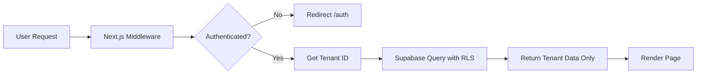

# KasirKu - Platform Kasir Digital SaaS untuk UMKM Indonesia

## Overview

KasirKu adalah platform SaaS (Software as a Service) Point of Sale (POS) yang dirancang khusus untuk UMKM (Usaha Mikro Kecil dan Menengah) di Indonesia. Platform ini menyediakan solusi kasir digital yang lengkap dengan fitur manajemen pesanan, nomor antrian otomatis, manajemen menu, dan pelaporan keuangan.

## Technology Stack

### Frontend & Framework
- **Next.js 14** with App Router - React framework untuk production dengan routing modern
- **TypeScript** - Type safety dan developer experience yang lebih baik
- **Tailwind CSS** - Utility-first CSS framework untuk styling
- **shadcn/ui** - Reusable React component library built with Radix UI dan Tailwind

### Backend & Database
- **Supabase** - Backend as a Service untuk:
  - Authentication (email/password)
  - PostgreSQL database
  - Row Level Security (RLS) untuk multi-tenant
  - Real-time subscriptions (optional)
  - Storage (jika diperlukan untuk gambar menu)

## Project Structure

```
kasirku/
├── .kiro/
│   └── specs/
│       └── kasirku-saas/
│           ├── .config.kiro
│           ├── requirements.md
│           ├── design.md (akan dibuat)
│           └── tasks.md (akan dibuat)
├── app/
│   ├── (public)/
│   │   └── page.tsx                    # Landing page (/)
│   ├── auth/
│   │   └── page.tsx                    # Login & Register (/auth)
│   ├── dashboard/
│   │   ├── layout.tsx                  # Protected layout
│   │   ├── page.tsx                    # Dashboard home
│   │   ├── order/
│   │   │   └── page.tsx                # Order input
│   │   ├── menu/
│   │   │   └── page.tsx                # Menu management
│   │   └── laporan/
│   │       └── page.tsx                # Reports
│   ├── layout.tsx                      # Root layout
│   └── globals.css                     # Global styles
├── components/
│   ├── ui/                             # shadcn/ui components
│   ├── auth/                           # Auth-related components
│   ├── dashboard/                      # Dashboard components
│   └── shared/                         # Shared components
├── lib/
│   ├── supabase/
│   │   ├── client.ts                   # Supabase client
│   │   ├── server.ts                   # Server-side Supabase
│   │   └── middleware.ts               # Auth middleware
│   ├── hooks/                          # Custom React hooks
│   └── utils.ts                        # Utility functions
├── types/
│   └── database.ts                     # TypeScript types for database
├── supabase/
│   ├── migrations/                     # Database migrations
│   └── seed.sql                        # Seed data (optional)
├── public/                             # Static assets
├── .env.local                          # Environment variables
├── next.config.js
├── tailwind.config.ts
├── tsconfig.json
├── package.json
├── STEERING.md                         # This file
└── README.md
```

## Multi-Tenant Architecture

KasirKu menggunakan arsitektur multi-tenant dimana setiap UMKM yang mendaftar mendapatkan tenant ID unik. Data isolation dilakukan menggunakan:

1. **Tenant Table**: Menyimpan informasi setiap UMKM
2. **Foreign Keys**: Semua tabel data (menu, orders) memiliki `tenant_id`
3. **Row Level Security (RLS)**: Supabase RLS policies memastikan user hanya dapat mengakses data tenant mereka
4. **Server-side Validation**: Middleware dan API routes memvalidasi tenant access

### Database Schema Overview

```sql
-- Tenants table
tenants
  - id (uuid, primary key)
  - name (text)
  - created_at (timestamp)

-- Users table (managed by Supabase Auth)
auth.users (Supabase managed)
  - id (uuid)
  - email (text)
  
-- User-Tenant relationship
user_tenants
  - user_id (uuid, references auth.users)
  - tenant_id (uuid, references tenants)
  - role (text, e.g., 'owner', 'cashier')

-- Menu items
menu_items
  - id (uuid, primary key)
  - tenant_id (uuid, references tenants)
  - name (text)
  - price (numeric)
  - created_at (timestamp)
  - updated_at (timestamp)

-- Orders
orders
  - id (uuid, primary key)
  - tenant_id (uuid, references tenants)
  - queue_number (integer)
  - total_amount (numeric)
  - status (text)
  - created_at (timestamp)

-- Order items
order_items
  - id (uuid, primary key)
  - order_id (uuid, references orders)
  - menu_item_id (uuid, references menu_items)
  - quantity (integer)
  - price (numeric)
```

## Key Features

### 1. Landing Page (/)
- Public page accessible tanpa login
- Informasi tentang KasirKu
- Call-to-action untuk register/login
- Responsive design

### 2. Authentication (/auth)
- Email/password authentication via Supabase
- Registration form untuk UMKM baru
- Login form untuk existing users
- Otomatis redirect ke dashboard setelah login
- Tenant creation otomatis saat register

### 3. Dashboard (/dashboard)
- Protected route (requires authentication)
- Overview bisnis
- Navigation ke fitur-fitur utama
- Sidebar/navbar dengan menu

### 4. Order Management (/dashboard/order)
- Input pesanan baru
- **Nomor antrian otomatis** - increment per tenant
- Select menu items dari database
- Calculate total
- Submit order
- Display queue number setelah submit

### 5. Menu Management (/dashboard/menu)
- CRUD operations untuk menu items
- Table/list view dengan search/filter
- Add menu item dengan nama dan harga
- Edit existing items
- Delete items (dengan confirmation)
- Harga dalam format Rupiah

### 6. Financial Reports (/dashboard/laporan)
- Toggle view: Daily / Weekly / Monthly
- Calculate total revenue dari orders
- Date range picker
- Display dalam format Rupiah (IDR)
- Export options (optional enhancement)

## Authentication Flow

```mermaid
graph TD
    A[User visits /] --> B{Has session?}
    B -->|No| C[Show landing page]
    B -->|Yes| D[Redirect to /dashboard]
    C --> E[Click Login/Register]
    E --> F[/auth page]
    F --> G{Register or Login?}
    G -->|Register| H[Create account + tenant]
    G -->|Login| I[Authenticate]
    H --> J[Create session]
    I --> J
    J --> D
```

## Data Flow



## Environment Variables Required

```env
# Supabase
NEXT_PUBLIC_SUPABASE_URL=your_supabase_url
NEXT_PUBLIC_SUPABASE_ANON_KEY=your_supabase_anon_key
SUPABASE_SERVICE_ROLE_KEY=your_service_role_key

# App
NEXT_PUBLIC_APP_URL=http://localhost:3000
```

## Development Guidelines

### Code Style
- Use TypeScript strict mode
- Follow Next.js App Router conventions
- Use Server Components by default, Client Components only when needed
- Implement proper error handling
- Use Zod for runtime validation (recommended)

### Security Considerations
1. **Never expose service role key** to client
2. **Always validate tenant_id** on server side
3. **Use RLS policies** for database-level security
4. **Sanitize user inputs** to prevent XSS
5. **Use prepared statements** to prevent SQL injection (Supabase handles this)

### Performance
- Use Next.js Server Components untuk better performance
- Implement loading states dengan Suspense
- Optimize images dengan next/image
- Use proper caching strategies
- Lazy load components where appropriate

### Testing Strategy (Future)
- Unit tests untuk utility functions
- Integration tests untuk API routes
- E2E tests untuk critical user flows
- Test multi-tenant isolation

## Queue Number Logic

Queue numbers auto-increment per tenant:

```typescript
// Pseudocode
async function generateQueueNumber(tenantId: string): Promise<number> {
  // Get last order for this tenant today
  const lastOrder = await getLastOrderToday(tenantId);
  
  if (!lastOrder) {
    return 1; // First order of the day
  }
  
  return lastOrder.queue_number + 1;
}
```

Options:
- Reset daily (1, 2, 3... reset next day)
- Or continuous increment (never reset)

## Supabase Setup Steps

1. Create new Supabase project
2. Run migrations untuk create tables
3. Set up RLS policies:
   ```sql
   -- Example RLS policy
   CREATE POLICY "Users can only access their tenant data"
   ON menu_items
   FOR ALL
   USING (
     tenant_id IN (
       SELECT tenant_id FROM user_tenants 
       WHERE user_id = auth.uid()
     )
   );
   ```
4. Create database functions for complex queries
5. Set up indexes untuk performance

## shadcn/ui Components to Use

- `Button` - For all buttons
- `Input` - For form inputs
- `Card` - For dashboard cards
- `Table` - For menu list and order history
- `Select` - For dropdowns (menu selection)
- `Dialog` - For confirmations (delete menu item)
- `Form` - For form handling with react-hook-form
- `Tabs` - For report period selection (daily/weekly/monthly)
- `Badge` - For order status
- `Separator` - For visual dividers

## Indonesian Rupiah Formatting

```typescript
function formatRupiah(amount: number): string {
  return new Intl.NumberFormat('id-ID', {
    style: 'currency',
    currency: 'IDR',
    minimumFractionDigits: 0
  }).format(amount);
}

// Output: Rp 50.000
```

## Routing Strategy

Next.js 14 App Router structure:

```
app/
├── (public)/           # Route group tanpa layout khusus
│   └── page.tsx        # / - Landing
├── auth/
│   └── page.tsx        # /auth - Login/Register
└── dashboard/
    ├── layout.tsx      # Protected layout dengan nav
    ├── page.tsx        # /dashboard
    ├── order/
    │   └── page.tsx    # /dashboard/order
    ├── menu/
    │   └── page.tsx    # /dashboard/menu
    └── laporan/
        └── page.tsx    # /dashboard/laporan
```

## Next Steps After Requirements

1. **Design Phase**: Create design.md dengan:
   - Component architecture
   - State management strategy
   - API endpoints/Server Actions
   - Database schema details
   - UI/UX wireframes (text descriptions)

2. **Task Breakdown**: Create tasks.md dengan:
   - Setup tasks (Next.js, Supabase, dependencies)
   - Database setup tasks
   - Authentication implementation
   - Feature implementation (per page)
   - Testing tasks

3. **Implementation**: Follow tasks.md untuk build

## Success Criteria

KasirKu dianggap berhasil jika:
- ✅ User dapat register dan login
- ✅ Setiap UMKM memiliki data terpisah
- ✅ User dapat create order dengan queue number otomatis
- ✅ User dapat manage menu items (CRUD)
- ✅ User dapat view laporan daily/weekly/monthly
- ✅ UI responsive di mobile dan desktop
- ✅ Semua dashboard routes ter-protect dengan auth

## Future Enhancements (Optional)

- Printer integration untuk print struk
- WhatsApp notifications untuk customer
- Inventory management
- Employee management dengan roles
- Multiple store locations per tenant
- Analytics dashboard
- Export laporan ke PDF/Excel
- Payment gateway integration
- Dark mode
- Multi-language support

## Resources

- [Next.js 14 Documentation](https://nextjs.org/docs)
- [Supabase Documentation](https://supabase.com/docs)
- [shadcn/ui Documentation](https://ui.shadcn.com)
- [Tailwind CSS Documentation](https://tailwindcss.com/docs)
- [TypeScript Documentation](https://www.typescriptlang.org/docs)

## Contact & Support

Untuk pertanyaan atau issues, silakan buat issue di GitHub repository atau hubungi tim development.

---

**Last Updated**: 2024
**Version**: 1.0.0
**Status**: Requirements Phase Complete
